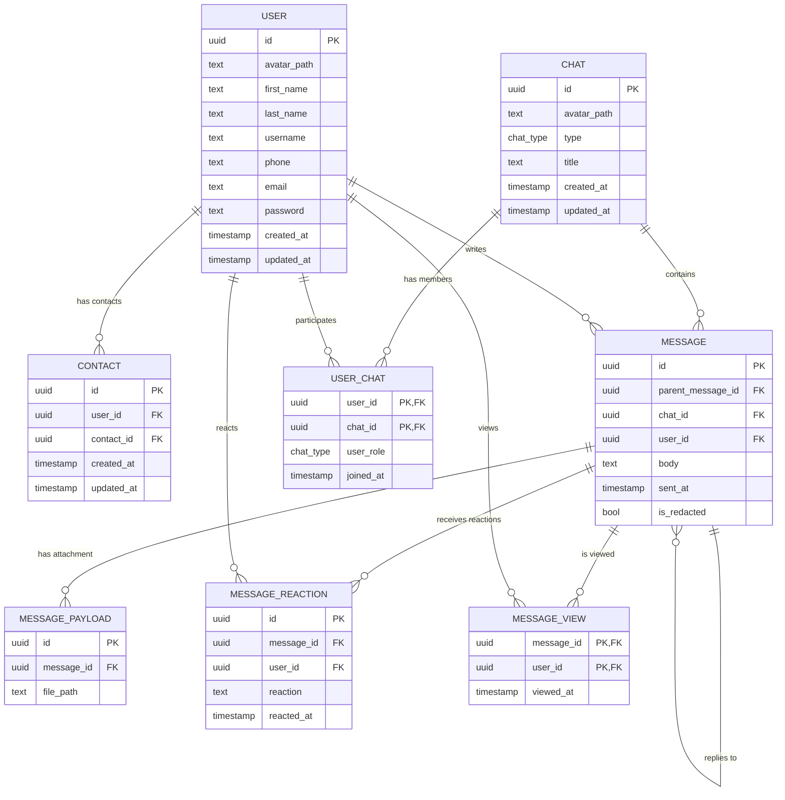

## Таблица `user`

**Функциональные зависимости:**
`{id} → {avatar_path, first_name, last_name, username, phone, email, password, created_at, updated_at}`

Таблица находится в **1НФ**, так как все атрибуты атомарны, а строки уникальны.

Таблица находится во **2НФ**, так как нет частичной зависимости от составного ключа (первичный ключ - `id`), все атрибуты зависят от этого ключа.

Таблица находится в **3НФ**, так как все атрибуты нетранзитивно зависят от первичного ключа.

Таблица находится в **НФБК**, так как единственные детерминанты — это первичный ключ `id`.

## Таблица `chat`

**Функциональные зависимости:**
`{id} → {avatar_path, type, title, created_at, updated_at}`

Таблица находится в **1НФ**, так как все атрибуты атомарны, а строки уникальны.

Таблица находится во **2НФ**, так как нет частичной зависимости от составного ключа (первичный ключ - `id`).

Таблица находится в **3НФ**, так как все атрибуты нетранзитивно зависят от первичного ключа.

Таблица находится в **НФБК**, так как единственные детерминанты — это первичный ключ `id`.

## Таблица `user_chat`

**Функциональные зависимости:**
`{user_id, chat_id} → {user_role, joined_at}`

Таблица находится в **1НФ**, так как все атрибуты атомарны, а строки уникальны.

Таблица находится во **2НФ**, так как нет частичной зависимости от составного ключа (первичный ключ — `{user_id, chat_id}`). Все атрибуты зависят от этого ключа.

Таблица находится в **3НФ**, так как все атрибуты нетранзитивно зависят от первичного ключа.

Таблица находится в **НФБК**, так как единственные детерминанты — это составной первичный ключ `{user_id, chat_id}`.

## Таблица `contact`

**Функциональные зависимости:**
`{id} → {user_id, contact_id, created_at, updated_at}`

Таблица находится в **1НФ**, так как все атрибуты атомарны, а строки уникальны.

Таблица находится во **2НФ**, так как нет частичной зависимости от составного ключа (первичный ключ — `id`).

Таблица находится в **3НФ**, так как все атрибуты нетранзитивно зависят от первичного ключа.

Таблица находится в **НФБК**, так как единственные детерминанты — это первичный ключ `id`.

## Таблица `message`

**Функциональные зависимости:**
`{id} → {parent_message_id, chat_id, user_id, body, sent_at, is_redacted}`

Таблица находится в **1НФ**, так как все атрибуты атомарны, а строки уникальны.

Таблица находится во **2НФ**, так как нет частичной зависимости от составного ключа (первичный ключ — `id`).

Таблица находится в **3НФ**, так как все атрибуты нетранзитивно зависят от первичного ключа.

Таблица находится в **НФБК**, так как единственные детерминанты — это первичный ключ `id`.

## Таблица `message_reaction`

**Функциональные зависимости:**
`{id} → {message_id, user_id, reaction, reacted_at}`  
`{message_id, user_id} → {reaction, reacted_at}`

Таблица находится в **1НФ**, так как все атрибуты атомарны, а строки уникальны.

Таблица находится во **2НФ**, так как нет частичной зависимости от составного ключа (первичный ключ — `id`), и вторая зависимость `{message_id, user_id} → {reaction, reacted_at}` является потенциальным ключом.

Таблица находится в **3НФ**, так как все атрибуты нетранзитивно зависят от первичного ключа.

Таблица находится в **НФБК**, так как единственные детерминанты — это `{message_id, user_id}` (потенциальный ключ).

## Таблица `message_view`

**Функциональные зависимости:**
`{message_id, user_id} → {viewed_at}`

Таблица находится в **1НФ**, так как все атрибуты атомарны, а строки уникальны.

Таблица находится во **2НФ**, так как нет частичной зависимости от составного ключа (первичный ключ — `{message_id, user_id}`).

Таблица находится в **3НФ**, так как все атрибуты нетранзитивно зависят от первичного ключа.

Таблица находится в **НФБК**, так как единственные детерминанты — это составной первичный ключ `{message_id, user_id}`.

## Таблица `message_payload`

**Функциональные зависимости:**
`{id} → {message_id, file_path}`

Таблица находится в **1НФ**, так как все атрибуты атомарны, а строки уникальны.

Таблица находится во **2НФ**, так как нет частичной зависимости от составного ключа (первичный ключ — `id`).

Таблица находится в **3НФ**, так как все атрибуты нетранзитивно зависят от первичного ключа.

Таблица находится в **НФБК**, так как единственные детерминанты — это первичный ключ `id`.

